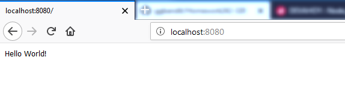

# Homework242-320
## เริ่มต้นคำสั่ง Hello World กับ Node.js
* เปิดโปรแกรม Node.js
* พิมพ์คำสั่งด้านล่าง
```sh
var http = require('http');
http.createServer(function (req, res) {
    res.writeHead(200, {'Content-Type': 'text/plain'});
    res.end('Hello World!');
}).listen(8080);
```
* เข้าหน้าเบราว์เซอร์ หลังจากนั้นใส่ลิงค์ http://localhost:8080/
### ผลลัพธ์

```sh
 require('http') : เป็นการ import module http ซึ่งเป็น module หลักของ Node.js
 createServer() : เป็นการสร้าง Server ของ Node.js โดยรับ function ที่มี request และ response
 res.writeHead() : เป็นการกำหนด Content Type
 res.end() : เป็นการสิ้นสุด response และส่งคำว่า Hello World
 .listen(port) : เป็นการกำหนด port ของเว็บ Server
```
## จัดทำโดย นายกิตตินันท์ ชาญปรีชา 5835512020
* ข้อมูลอ้างอิง https://devahoy.com/posts/getting-started-with-nodejs/